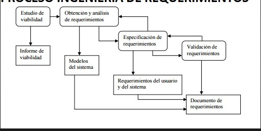
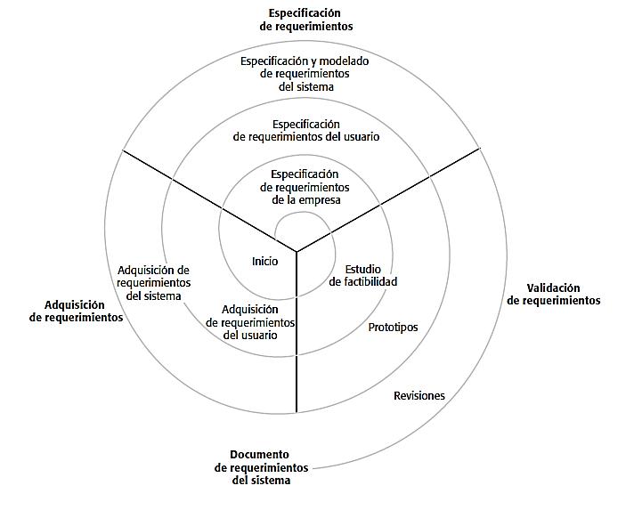

# Casos de Uso

## Requerimientos funcionales
interaccion entre el sistema y su ambiente. Describe que tiene que hacer y que **no tiene** que hacer.Se pueden expresarde distintas formas

## Requerimientos no funcionales
describe restricciones que limitan las elecciones. Que carateristicas hay que tener en cuenta; legales privacidad, seguridad, eficiencia, lenguajes de programacion. Políticas y procedimientos existentes

## Ingenieria de requerimientos
El proceso de transformacion de los requerimientos delcllarados por el cliente.

Proceso secuencial.

- gestionar necesidades del proyecto de forma estructurada
- mejora la capacidad de prececir cronogramas de proyectos
- disminuye los costos y retraasos del proyecto
- mejora la calidad del software
- mejora la comunicacion del equippo
- evita **rechazos de usuarios finales**

Fases de documentacion de requerimientos.

## Estudio de Viabilidad

Informe sobre la convenciencia o no de realizar el proyecto.

Validacion de requerimientos es certificar la correccion del modelo de requerimientos.
Verficacion de requerimientos es certificar que se hace el software correcto

**Validacion de requerimientos** se hace al final del desarrollo para asegurar que cumple con los requerimientos

**Verificacion de requerimientos** el software cumple con los requerimientos correctamente. -> se verifica **contra los requerimientos**

## Casos de Uso (CU)

Diagrama: representa una funcionalidad individual del sistema.
Actor: es el que va a iniciar una actividad en el sistema.

Relaciones:
  - asociacion
  - extension
    - **<< extends >>** herencia o pre-condiciones. Invocado por un solo CU
  - uso o inclusión
    - **<< uses >>** si invocan 2 o más CUs
  - herencia
    - Un actor hereda funcionalidades de otro/s actores

### Escenarios

- Interaccion entre usuarios y sistema
- Eventos alternativos

Pasos
- Identificar los actores (quiern recivie informacion del sistema)
- Identificar los CU para los requerimientos ()
- Construir el diagrama
- Realizar los escenarios