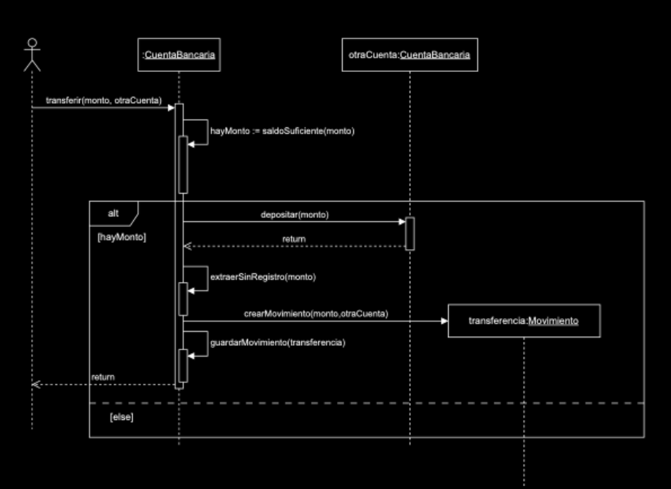
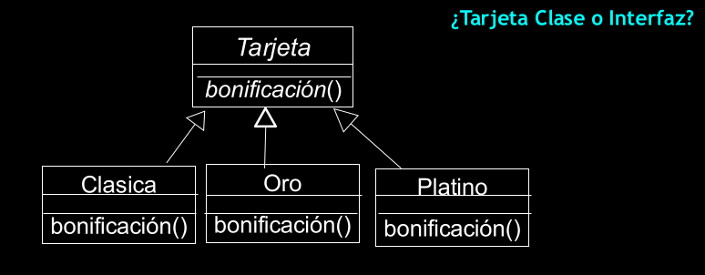

# Contratos

## Casos de Uso

## Secciones del contrato

- **Operacion** --> nombre de op y params
- **Precondiciones** --> supociciones relevantes
- **Post-condiciones** --> estadoddel sistema o de obj.

### Contratos -> Test de Unidad

- son la antesala de los test de unidad
- definen req. en términos de **pre** y **post** condiciones

## Diagramas de secuencia en UML

diseñar diagramas de clases representando las clases que seran representadas
--> reprentan instancias, transiciones y estados
--> el tiempo transcurre hacia abajo
--> se pueden hacer nuevos diagramas para describir procesos especificos del diagrama

## Heurísticas para Asignación de Responsabilidad (HAR)

### Responsabilidades de los obj.

Que **hacen** -> hacen algo por si mismo, controlar, coordinar actividades con otros obj. e iniciar una accion en otros obj.

A quien **conocer** *para hacer* -> conocer sus datos privados encapsulados, conocer sus obj. relacionados y conocer cosas derivables o calculables.

### Heurisitas para asignar responsabilidades

*Generalmente* sucede durante la creacion de lkos diagramas de secuencia.

### Heuristicas para creador

Asginar a las clase B la responsabiliadd de crear una instancia de A si:
    - **B usa obj de A en en forma exclusiva**, ningun otro sabe de este obj.
    - B contiene obj A --> Agregación, composición
    - B tiene los datos para inicializar obj. A

**Bajo acoplamiento**
es la medida de dependencia de **un objeto con otros**. Es bajo si mantiene pocas relaciones con otros objetos

**Alta cohesión** 
asiganar responsabilidadesd de manera que la cohesion se matenga lo mas fuerte posible

## Diagramas de Secuencia

- Se crea un diagrama de secuencia por cada op. asociada al caso de uso
- Si queda complejo, se separa en diagramas menos cmplejos, uno por cada escenario.
- Se usa el **contrato de la operacion** como punto de partida; se piensa en obj. que colaboran para cumplir la tarea
- Se aplica las **heurísticas para asignacion de responsabiliades** para obtener un mejor diseño

### Ejemplo

- **Operacion**: contratar servicio por unica vez
- **Pre-condicion**: la fecha es la fecha valida para el contexto
- **Post-condicion**: el cliente posee una contrtacion por unica vez para el servicio y la fecha indicada.

### Interface vs Abstract

Si la clase no se va a instanciar y tiene campos entonces es una clase abstracta, si no tiene variables o implementaciones concrets entonces es un abstract.

