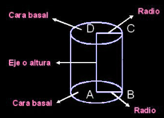

# Ejercicio 7: Figuras y cuerpos
**Figuras en 2D**
En Taller de Programación definió clases para representar figuras geométricas. Retomaremos ese ejercicio para trabajar con Cuadrados y Círculos.
El siguiente diagrama de clases documenta los mensajes que estos objetos deben entender. 

**Fórmulas y mensajes útiles:**     
- Diámetro del círculo: radio * 2
- Perímetro del círculo: π * diámetro
- Área del círculo: π * radio 2
- π se obtiene enviando el mensaje #pi a la clase Float (Float pi) (ahora Math.PI) 

**Tareas:**
1. **Implementación:**
    Defina un nuevo proyecto figurasYCuerpos. Implemente las clases Círculo y Cuadrado, siendo ambas subclases de Object. Decida usted qué variables de instancia son necesarias. Puede agregar mensajes adicionales si lo cree necesario.
2. **Discuta y reflexione**
    ¿Qué variables de instancia definió? ¿Pudo hacerlo de otra manera? ¿Qué ventajas encuentra en la forma en que lo realizó? 

**Cuerpos en 3D**
Ahora que tenemos Círculos y Cuadrados, podemos usarlos para construir cuerpos (en 3D) y calcular su volumen y superficie o área exterior. 
- Vamos a pensar a un cilindro como "un cuerpo que tiene una figura 2D como cara basal y que tiene una altura (vea la siguiente imagen)". Es decir, si en el lugar de la figura2D tuviera un círculo, se formaría el siguiente cuerpo 3D.

- Si reemplazamos la cara basal por un rectángulo, tendremos un prisma (una caja de zapatos).

El siguiente diagrama de clases documenta los mensajes que entiende un cuerpo3D. 

**Fórmulas útiles:**
- El área o superficie exterior de un cuerpo es: 2* área-cara-basal + perímetro-cara-basal * altura-del-cuerpo
- El volumen de un cuerpo es: área-cara-basal * altura

Más info interesante: A la figura que da forma al cuerpo (el círculo o el cuadrado en nuestro caso) se le llama directriz. Y a la recta en la que se mueve se llama generatriz. En wikipedia (Cilindro) se puede aprender un poco más al respecto.
**Tareas:**
1. **Implementación**
	Implemente la clase Cuerpo 3D, la cuál es subclase de Object. Decida usted qué variables de instancia son necesarias. También decida si es necesario hacer cambios en las figuras 2D.
2. **Pruebas automatizadas**
    Siguiendo los ejemplos de ejercicios anteriores, ejecute las pruebas automatizadas provistas. En este caso, se trata de tres clases (CuerpoTest, TestCirculo y TestCuadrado) que debe agregar dentro del paquete tests. Haga las modificaciones necesarias para que el proyecto no tenga errores.  Si algún test no pasa, consulte al ayudante. 
3. **Discuta y reflexione**
    Discuta con el ayudante sus elecciones de variables de instancia y métodos adicionales. ¿Es necesario todo lo que definió?
